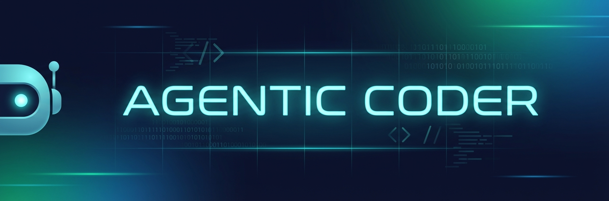

# Agentic Coder 🤖

<p align="center">
  
</p>

<p align="center">
  
</p>

<p align="center">
  <strong>Your AI-Powered Project Creator & Iterative Developer</strong>
</p>

<p align="center">
  <a href="https://pypi.org/project/agentic-coder/"></a>
  <a href="https://pypi.org/project/agentic-coder/"></a>
  <a href="https://github.com/mohamedabubasith/coding-agent/blob/main/LICENSE"></a>
</p>

---

## What is Agentic Coder?

**Agentic Coder** creates complete, production-ready projects from natural language descriptions. It thinks, plans, codes, tests, and iteratively improves your projects.

### Key Features

- 🎯 **Autonomous Project Creation** - Create complete projects from a single prompt
- 🔄 **Iterative Improvement** - Continuously improve your project with natural language
- 🎨 **Interactive Planning** - Review and approve plans before generation
- 🔐 **Version Control** - Auto-initializes Git repository and commits changes
- 🌐 **Multi-Provider Support** - Works with OpenAI, NVIDIA, Groq, and local models

## Quick Start

### Installation

```bash
pip install agentic-coder
```

### Configuration

Create a `.env` file:

```env
LLM_API_KEY=your_api_key_here
LLM_MODEL=gpt-4o
```

### Usage

**Create a project:**
```bash
agentic-coder create "FastAPI backend with JWT auth"
```

**Improve existing project:**
```bash
cd projects/my_project/
agentic-coder improve "add email verification"
```

**Interactive mode:**
```bash
agentic-coder improve --interactive
```

## Examples

### Create a Full-Stack Project
```bash
agentic-coder create "FastAPI backend with:
- User authentication (JWT)
- CRUD operations for todos
- PostgreSQL database
- Comprehensive tests" --interactive
```

### Iteratively Improve
```bash
cd projects/my_app/
agentic-coder improve "add rate limiting"
agentic-coder improve "add logging"
agentic-coder improve "optimize database queries"
```

## Supported LLM Providers

**OpenAI:**
```env
LLM_API_KEY=sk-...
LLM_MODEL=gpt-4o
```

**NVIDIA:**
```env
LLM_BASE_URL=https://integrate.api.nvidia.com/v1
LLM_API_KEY=nvapi-...
LLM_MODEL=qwen/qwen3-next-80b-a3b-instruct
```

**Groq:**
```env
LLM_BASE_URL=https://api.groq.com/openai/v1
LLM_API_KEY=gsk_...
LLM_MODEL=llama-3.3-70b-versatile
```

## Documentation

- [User Guide](USER_GUIDE.md) - Complete walkthrough
- [Roadmap](ROADMAP.md) - Upcoming features
- [Contributing](CONTRIBUTING.md) - How to contribute
- [Publishing Guide](PUBLISHING.md) - PyPI deployment

## Roadmap

### Coming in v0.2.0
- 🔌 **MCP Server Integration** - Connect custom tools and context
- 📦 **Project Templates** - Pre-built templates (FastAPI, Next.js, React, etc.)
- 📊 **Cost Tracking** - Monitor and control LLM costs
- 🔄 **Undo/Redo** - Easy change rollback

[See full roadmap](ROADMAP.md)

## Support

- 🐛 [Report a bug](https://github.com/mohamedabubasith/coding-agent/issues)
- 💡 [Request a feature](https://github.com/mohamedabubasith/coding-agent/issues)
- 💬 [Discussions](https://github.com/mohamedabubasith/coding-agent/discussions)

## License

This project is licensed under the **MIT License**.

**What this means:**
- ✅ Commercial use allowed
- ✅ Modification allowed
- ✅ Distribution allowed
- ✅ Private use allowed
- ⚠️ Provided "as is" without warranty

See the [LICENSE](LICENSE) file for full details.

---

<p align="center">
  Made with ❤️ by <a href="https://github.com/mohamedabubasith">Mohamed Abu Basith</a>
</p>

<p align="center">
  <a href="https://github.com/mohamedabubasith/coding-agent">⭐ Star us on GitHub</a> • 
  <a href="https://pypi.org/project/agentic-coder/">📦 Install from PyPI</a>
</p>
